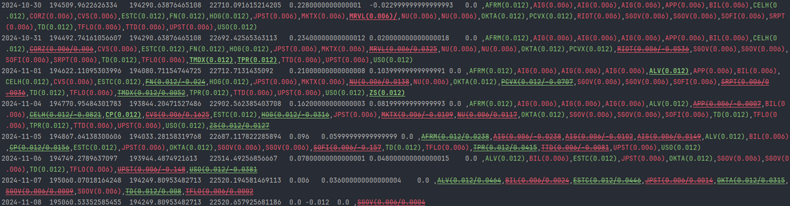
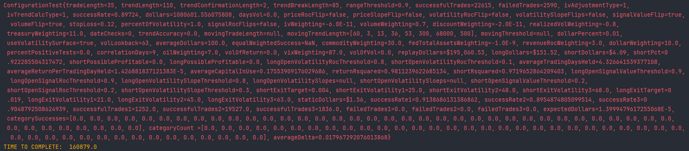

# 📊 Quant_Fork

**Quant_Fork** is a Java-based quantitative trading backtesting engine. It simulates trading strategies using historical stock and options data to evaluate performance and refine strategy parameters. The system models both implied and realized volatility, tracks trades, and performs multi-series cumulative distribution functions for signal generation.

---

## ⚙️ Core Logic

### 1. Backtesting Engine
- **`Trade` and `TradeLog`** manage the lifecycle of trades, including entry, exit, and tracking performance metrics.
- **`BasicBucketReadout`** computes trade success rates and average returns, offering bucketed statistical summaries.

### 2. Mathematical Modeling
- **Exponential Regression (e.g., `eExponentialRegression`)**:
    - Performs a log-linear regression to fit data to the form:
      ```
      y = ae^{bx}
      ```
    - Used to detect growth/decay trends in stock features like volatility or returns.
- **Volatility Models**:
    - **`ImpliedVolaility`**: Captures forward-looking market volatility derived from option prices.
    - **`RealizedVolatility`**: Measures historical price volatility.
- **Rate of Change & Regression Slopes**:
    - **`RegressionCompareObject`** stores slopes and ROC values across long/short windows to compare current market regimes.

### 3. Stock Calculation Library
- **`StockCalculationLibrary`**:
    - Computes various statistical indicators.
    - Interfaces with volatility repositories and caches to avoid redundant computations.

### 4. Option Contracts
- Models include strike, expiration, implied volatility, VWAP, and price for evaluating options strategies.

### 5. Cumulative Distributions
- Relies upon CDFs for relative extrema to generate trade signals.
---

## 🧠 Statistical Techniques Used

- Cumulative Distribution Functions
- Linear Regression
- Exponential Curve Fitting
- Moving Average Smoothing
- Volatility Clustering
- Bucket Analysis for PnL (Profit and Loss)
---

## 📁 Project Structure

- `BackTest/` – Core backtesting logic, regression, and trade data structures.
- `Model/` – POJOs for data structures (Bars, Tickers, Volatility, Options).
- `Libraries/` – Calculation utilities and helpers.
- `Repository/` – Database interaction logic for volatility data.
- `Threads/` – Multi-threaded data ingestion and simulation support.
- `Fetchers/` – Logic to acquire and preprocess historical data.



